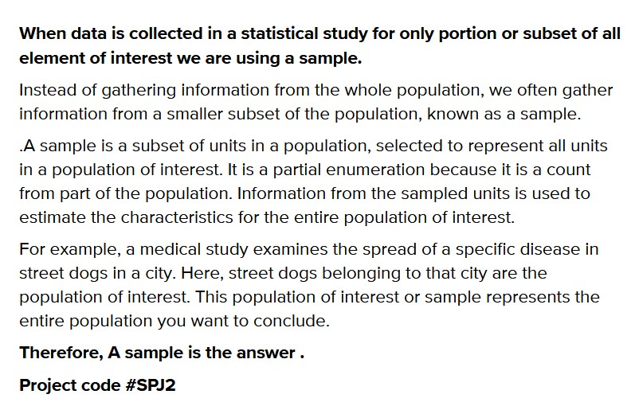
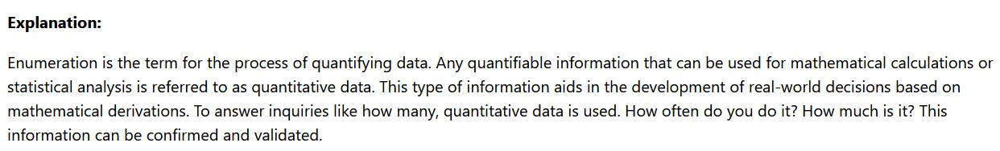
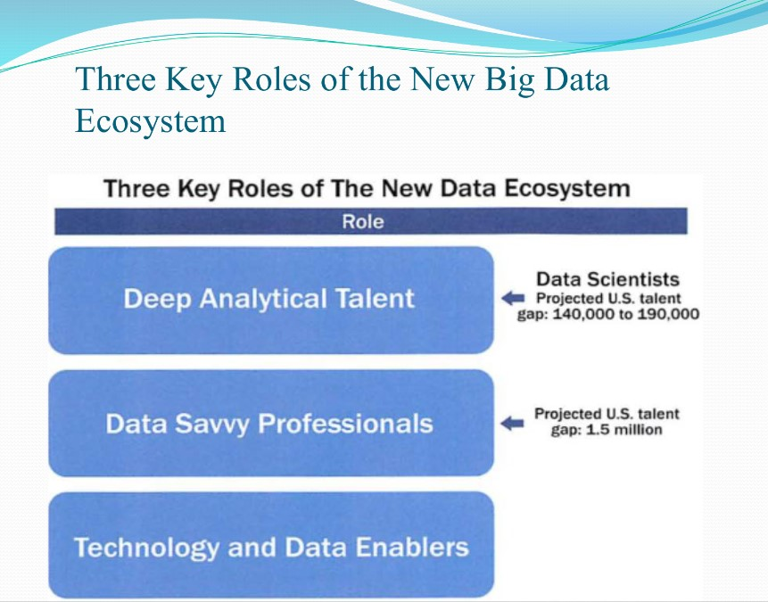
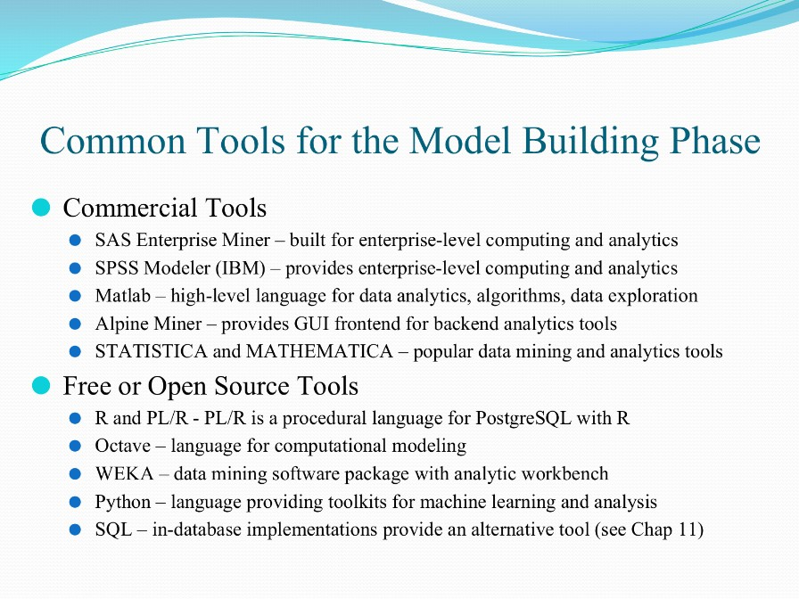

### DSML MCQs 

## Unit 1 An Intro To Data Science

> Q1. Types of Big data are?

    1. Structured Data
    2. Unstructured Data
    3. Semi-structured Data
    4. All the above

**Answer**  : All the above (Option 4)

<image src="./Images/typesofdata.jpg"></image>

> Q2. Which is the correct sequence of phases of Data Analytics life cycle

    1. Discovery-->Modelplanning & building-->datapreparation-->communicating result-->operationalize

    2. Modelplanning & building-->DataPreparation-->communicating result-->operationalize-->Discovery

    3. Discovery-->DataPreparation-->model Planning & building-->communicating result->operationalize

    4. DataPreparation-->model Planning & building-->operationalize-->communicatingresult->Discovery

**Answer  :** Option 3

<image src="./Images/dataanalyticlifecycle.jpg"></image>

> Q3. Pick out the correct statement.

    1. Raw data is original source of data
    2. Preprocessed data is original source of data
    3. Raw data is the data obtained after processing steps
    4. None of the mentioned

**Answer :** Option 1

<https://www.coursehero.com/file/p56n4lcu/Point-out-the-correct-statement-a-Raw-data-is-original-source-of-data-b/>

<https://www.datamation.com/big-data/raw-data/#:~:text=Raw%20data%20is%20the%20starting%20phase%20of%20all,You%20can%20trust%20the%20integrity%20of%20raw%20data.>

> Q.4 Which is not among the 5 V's of Big data?

    1. Velocity
    2. Value
    3. Variety
    4. None of the above

**Answer :** Option 4

https://www.geeksforgeeks.org/5-vs-of-big-data/

> Q5. which phase of the data analytics lifecycle usually takes the longest time?

    1. Data Preparation
    2. Model Planning
    3. Model Building
    4. Communicate Results

**Answer :**  Option 1

https://vceguide.com/which-phase-of-the-analytic-lifecycle-would-you-expect-to-spend-most-of-the-project-time/

> Q6. Which of the following can be generally used to clean and prepare big data?

    1. Pandas
    2. Data Lake
    3. U-SQL
    4. Data Warehouse

**Answer :**  Option 4

https://www.google.com/search?q=Which+of+the+following+can+be+generally+used+to+clean+and+prepare+big+data

> Q7. When data are collected in a statistical study for only a portion or subset of all elements of interest we are using ______

    1. Sample 
    2. Parameter
    3. Population
    4. None

**Answer :**  Option 1




> Q8. The process of quantifying data is referred to as?

    1. Decoding
    2. Structure
    3. Enumeration
    4. Coding

**Answer :**  Option 3



<br>

> Q9. What answers the question "What has happened?

    1. Descriptive analytics
    2. Predictive analytics
    3. Prescriptive analytics
    4. None

**Answer :**  Option 1

*Explanation : Descriptive analytics describes what has happened* 

> Q10. what answers the question "What will happen?"?

    1. Descriptive analytics
    2. Predictions analytics
    3. Prescriptive analytics
    4. None

**Answer :** Option 2

*Explanation : As predictive model predicts what will happen in the future*

> Q11. _____ useful knowledge from data to solve business problems can be treated systematically by following a process with reasonably well-defined stages.

    1. Extracting
    2. Preparing
    3. Prescribing
    4. None

**Answer :**  Option 1

*Explanation : Knowledge cannot be prescribed, prepared so it has to extracted*

> Q12. ______ is most important language for Data Science.

    1. Java
    2. R
    3. Python
    4 .None of the mentioned

**Answer :** Option 3

*Explanation : https://www.dasca.org/world-of-big-data/article/top-6-programming-languages-for-data-science-in-2021*

> Q13. Data Analysis is a process of ______

    1. Inspecting data
    2. Data Cleaning
    3. Transforming of data
    4. All of the mentioned above

**Answer :** Option 4

*Explanation : The process of reviewing, cleansing, and manipulating data with the objective of identifying usable information, informing conclusions, and assisting decision-making is known as data analysis. Data analysis is important in today's business environment since it helps businesses make more scientific decisions and run more efficiently.*

> Q14. By 2025, the volume of data will increase to ______

    1. TB
    2. YB
    3. ZB
    4. EB

**Answer :**  Option 3

*Explanation : It is projected that 2.5 quintillion bytes of data are created every day, with the volume of digital data expected to reach Zeta Byte by 2025.*

> Q15. A good data analytics solution includes a viable self-service ___

    1. Data mining
    2. Data wrangling
    3. Data warehouse
    4. None of the mentioned above

**Answer :** Option 2

*Explanation : A smart data analytics solution incorporates self-service data wrangling and data preparation features so that data may be simply and quickly gathered from a range of incomplete, difficult, or messy data sources and cleansed for mashup and analysis.*

> Q16. Choose the primary characteristics of big data among the following

    1. Velocity
    2. Volume
    3. Velocity
    4. All of the above

**Answer :** Option 4

*Explanation :*


<br>

> Q17. Which of the following is not a part of the data science process.

    1. Communication Building
    2. Discovery
    3. Operationalize
    4. Model Building

**Answer :** Option 1

*Explanation : Data science process = Discovery-->DataPreparation-->model Planning & building-->communicating result->operationalize*


> Q18. Which of the following is wrong attribute regarding with BIG Data characteristics 

    1. Huge volume of data
    2. complexity of data types and structures
    3. less amount of data handling
    4. high speed generation of data

**Answer :** Option 3

*Explanation : There is always large amount of data handling in case of Big Data*

> Q19. In which way, we can not represent the data?

    1. Structured data
    2. Heavy-structured data
    3. Quasi-structured Data
    4. unstructured data

**Answer :** Option 2

*Explanation : only heavy structured data cannot be read represented*

> Q20. Transaction of data of the bank is a type of.

    1. Structured data
    2. Unstructured data
    3. semi structured data
    4. hybrid 

**Answer :**  Option 1

*Explanation : Transaction data is well structured to begin with*

> Q21. Which of the following can be generally used to clean and prepare big data.

    1. pandas
    2. data lakes
    3. u-sql
    4. Data Warehouse

**Answer :** Option 4

*Explanation : Data Warehouses are used for big data where data is cleaned and stored*

> Q22. What are the roles which are important in New Data Ecosystem?

    1. Deep analytical talent
    2. Data Savvy Professionals
    3. Technology and data enablers
    4. All of the above 

**Answer :** Option 4

*Explanation :*



<br>

> Q23. Hadoop , Alpine Miner and Data Wrangler are common tools used in which part of the data science process

    1. Model Planning
    2. Model Building
    3. Communicate Results 
    4. Data Preperation

**Answer :**  Option 4

*Explanation :*


<br>

> Q24 Machine learning is a subset of which of the following 

    1. AI
    2. Deep learning
    3. Data mining
    4. None

**Answer :** Option 1

*Explanation : Machine learning (ML) is the subset of artificial intelligence (AI) that focuses on building systems that learn—or improve performance—based on the data they consume.*

> Q25. Identify the operation which can be performed in the data warehouse.

    1. alter 
    2. modify
    3. scan
    4. read/write

**Answer :**  Option C

*Explanation Data Loading is the operation that happens in data warehouses and in order to load data we have to scan it!*

> Q26.Which of the following platform provides the parallel ingestion and analysis

    1. Hadoop
    2. Alpine miner
    3. Open Refine
    4. Data Wrangler

**Answer :** Option 1

*Explanation : Hadoop can perform parallel ingest and analysis. you can also see the screenshot of question 23*

> Q27. Alpine miner, a free software tool is used for___

    1. Data cleaning 
    2. Data generation 
    3. Data transformation 
    4. both A and C

**Answer :** Option D

*Explanation :*


<br>


<br>
> Q28. DSS in data warehouse stands for

    1. data support system
    2. decision support system
    3. data storable system
    4. decision sible system

**Answer :**  Option 2

*Explanation : A decision support system (DSS) is a computerized program used to support determinations, judgments, and courses of action in an organization or a business.*

> Q29. Which of the following is not one of the main players in big data ecosystem?

    1. Data Devices
    2. Data Collectors 
    3. Data Users
    4. None of the above  

**Answer :** Option D

*Explanation :*


> Q30. Which of the following is  a required skillset for a data scientist?

    1. Quantitaive Skills
    2. Technical Aptitude
    3. Curious and Creative 
    4. All of the above

**Answer :** Option D

*Explanation : A data scientist should have following ability to play the role of data scientist: Understanding of domain,Business strategy,Problem solving, Communication,Presentation,Keenness*

> Q31. Big data is measured in ___bytes.

    1. Mega
    2. Giga
    3. Tera
    4. Peta

**Answer :**  Option 4

*Explanation : Big data is measured in Peta bytes*

> Q32. Which of the following is a common tool used in model planning phase?

    1. R 
    2. Hadoop
    3. Java
    4. None

**Answer :**  Option 1

*Explanation : All the ML models can be made using R*

> Q33. Which of the following is performed by Data Scientist?

    1. Define the question
    2. Create reproducible code
    3. Challenge results
    4. All of the mentioned

**Answer:** option 4

*Explanation: A data scientist is a job title for an employee or business intelligence (BI) consultant who excels at analyzing data, particularly large amounts of data.*

> Q34. Raw data should be processed only one time.

    1. True
    2. False

**Answer:** 2

*Explanation: Raw data may only need to be processed once.*

> Q35. 3V’s are not sufficient to describe big data.

    1. True
    2. False

Answer: option 1

*Explanation: IBM data scientists break big data into four dimensions: volume, variety, velocity and veracity.*

> Q36. Velocity is the speed at which the data is processed -

    1.True
    2.False

Answer: option 1

*Explanation:The rate at which data is generated, distributed, and gathered is referred to as data velocity. High data velocity is created at such a rapid rate that it necessitates the use of specialized processing techniques. The faster data can be captured and processed, the more valuable the data collected will be and the longer it will hold its worth.*

> Q39. ___ refers to the ability to turn your data useful for business.

    1.Value
    2.Variety
    3.Velocity
    4.None of the mentioned above

**Answer:** option 1 

*Explanation: The ability to turn our data into business value is referred to as value. The usefulness of obtained data for our business is referred to as data value. Data, regardless of its magnitude, is rarely useful on its own; to be useful, it must be transformed into insights or knowledge, which is where data processing comes in.*

> Q40. To glean insights from the data, many analysts and data scientists rely on ___.

    1.Data mining
    2.Data visualization
    3.Data warehouse
    4.All of the mentioned above

Answer: option 2

*Explanation: Many analysts and data scientists use data visualization, or the graphical depiction of data, to assist individuals visually explores and finds patterns and outliers in the data in order to get insights.Data visualization features are included in a good data analytics system, making data exploration easier and faster.*

> Q41. Data Modeling is the process of analyzing the data objects -

    1.True
    2.False

Answer: option 1

*Explanation: The practice of evaluating data items and their relationships with other things is known as data modeling. It's utilized to look into thedata requirements for various business activities. The data models are constructed in order to store the information in a database.*

> Q42. The Process of describing the data that is huge and complex to store and process is known as ___.

    1.Analytics mining
    2.Data cleaning
    3.Big data
    4.None of the mentioned above

Answer: option 3 

*Explanation: Big data is a term used to describe the process of describing data that is large and difficult to store and interpret. Big data analytics is the use of advanced analytic techniques to very large, heterogeneous big data sets,which can contain structured, semi-structured, and unstructured data, as well as data from many sources and sizes ranging from terabytes to zettabytes.*


## Unit 2  Preprocessing and Extracting meaning from Data 

> Q1. Which of following is a problem that missing data could cause?

    1. Some visualizations don't 
       work with missing data
    2. Some types of data  
       cleaning steps won't work 
       with null values
    3. Machine learning models 
       will break when they 
       encounter null values
    4. All the above

**Answer :**  Option 2

*Explaination : Visualization represents the remaining values instead of missing values, Machine learning models do work with less accuracy which only means that Data cleaning steps will not work*

> Q2. Select all valid strategies for dealing with null values in a column containing numerical data, assuming that we can't afford to lose any data.

Strategies : <br>

1. Replace missing values with the column median
2. Replace missing values with the column mode
3. Convert the column to categorical format using Coarse Classification ('Binning')
4. Leave the Null values as is.

<br>

    1. Strategy 1 & Strategy 2
    2. Strategy 3 & Strategy 1
    3. Strategy 4 & Strategy 1
    4. Strategy 3 & Strategy 2 

**Answer :**  Option 2

*Explanation : While replacing the values in columns we use median not mode so Strategy 1 is fixed. Considering the scenario we cannot leave the null values as it is so Strategy 3 is also fixed so answer will be Option 2*

> Q3. Which of the following code snippets returns a count of the missing values in each column of a DataFrame?

```python
1. some_dataframe.isna().sum()
2. some_dataframe.dropna()
3. some_dataframe.is_na().sum()
4. some_dataframe.value_counts.is_na()
```

**Answer :**  Option 1

*Explanation : some_dataframe.isna() gives null values for each column we just have to use sum to get all the null values*

> Q4. Impact of having noise in data / noisy data?

    1. Increases amount of storage space required 
    2. Decreases amount of storage space required 
    3. No impact on amount of storage space required
    4. None of the above

**Answer :** Option 1

*Explanation : A big chunk of your data is junk, but that gets stored in your database somehow creating the requirement of big database and cost associated with it.*

> Q5 Which learning method, algorithm or popular technique commonly used for handling the noise in data mining?

    1. Clustering 
    2. Binning
    3. Regression
    4. All the above

**Answer:**  Option 4

*Explanation : Binning smooths the corrupted data and hence is used to handle noise in data. Other useful techniques to find out noise in data are: clustering method, support vector machine (SVM) algorithm etc.*

> Q6. What happens in clustering method like k-means that is used to handle noise or noisy data in data mining?

    1. Data is organised into clusters
    2. Data is arranged in a line
    3. Any of the above
    4. None of the above

**Answer :** Option 1

*Explanation : The Values lying outside of it are considered as outliers. Thus clusters are made.*

> Q7. What is the difference between a bar chart and a histogram?

    1. Bar charts represent numbers, 
       whereas histograms represent 
       percentages 
    2. A histogram does not show the entire  
       range of scores in a distribution. 
    3. There are no gaps between the bars on 
       a histogram
    4. Bar charts are circular, 
       whereas histograms are square.

**Answer :**  Option 3

*Explanation : Histograms are used to display interval/ratio variables, which involve a continuous range of values, and so there are no gaps between the bars that represent each category.*

> Q8. The worst thing that missing data does is lower sample size and reduce power.

    1. True 
    2. False

**Answer :**  Option 2

*Explanation : If you lose half your sample and have no significant results, you notice.  If the regression coefficients or standard errors aren’t what they’re supposed to be, there’s no way to tell.*

> Q9. Data reduction  is/includes ________

    1. Data-flow diagram show, 
       how data is processed at different stages 
       in the system
    2. registering all/ selected activities of a 
       computer system.
    3. Technique used to transform raw data into 
       a more useful form..
    4. Data is shifted to modern data base 
       management system.

**Answer :** Option 3

*Explanation : In data reduction useless data is removed*

> Q10 Which of the following is not a data pre-processing methods?

    1. Data Visualization
    2. Data Discretization
    3. Data Cleaning 
    4. Data Reduction

**Answer :**  Option 1

*Explanation : Data Visualization is a step after data pre-processing*

> Q10. In Binning, we first sort data and partition into (equal-frequency) bins and then which of the following is not a valid step?

    1. Smooth by bin boundaries 
    2. Smooth by bin mean
    3. Smooth by bin median
    4. Smooth by bin values 

**Answer :**  Option 4

*Explanation : We can smooth the data by bin boundaries, mean, median only binning by values doesn't make sense here*

> Q11. Which of the following statements is true for correlation analysis?

    1. It is a bivariate analysis
    2. It is a multivariate analysis
    3. It is a univariate analysis
    4. Bivariate analysis and univariate analysis

**Answer :**  Option 3

*Explanation : It investigates the relationship between two data sets, with a pair of observations taken from a single sample or individual. Can be univariate*

> Q12. Choose the least likely assumption of a classic normal linear regression model

    1. The independent variable and the dependent 
       variable have a linear relationship.
    2. The independent variable is normally distributed
    3. There is no randomness in the independent 
       variable.
    4. None of the preceding.

**Answer :**  Option 2

*Explanation: https://economictheoryblog.com/2015/04/01/ols_assumptions/*

> Q13. The correlation coefficient is?

    1. The square of the coefficient of determination
    2. Can never be negative
    3. The square root of the coefficient of determination.
    4. The same as r square

**Answer :**  Option 3

*Explanation : Coefficient of Determination has been defined as the square of the coefficient of correlation*

> Q14. What is the value of the correlation coefficient if the coefficient of determination is 0.81?

    1. Must be positive
    2. 0.656
    3. Either +0.9 or -0.9
    4. Must be negative

**Answer :**  Option 3

*Explanation : Coefficient of Determination has been defined as the square of the coefficient of correlation*

> Q15. Regression modelling is a statistical tool for building a mathematical equation depicting how?

    1. One explanatory and one or above response 
       variables are related
    2. There is a link between one response 
       variable and one or many explanatory variables
    3. Several explanatory and response  
       variables are related
    4. All of the above are correct.

**Answer :**  Option 2

*Explanation : Regression analysis is one of the machine learning techniques that are used to describe the relationship between variables. There are two types of variables in regression analysis: independent variables (whose values can be manipulated) and dependent variables (whose values depend on the values of the independent variables). Regression analysis establishes the relationship between a single dependent variable and one or more independent variables. Therefore, regression analysis is a statistical procedure for developing a mathematical equation that describes how one dependent and one or more independent variables are related.*

> Q16. If any regression coefficient’s value is zero, the two variables are

    1. Independent
    2. Qualitative
    3. Dependent
    4. None of the above

**Answer :** Option 1

*Explanation : Regression line is a straight line parallel to x axis*

> Q17. Which of the given strategies helps provide the prediction mechanism by analysing the relationship between two variables?

    1. Regression
    2. Standard error
    3. Correlation
    4. None

**Answer :**  Option 1

*Explanation : Regression analysis is one of the machine learning techniques that are used to describe the relationship between variables and also make prediction on one variable*

> Q18. For two variables, X and Y, there can be a maximum of ___ lines

    1. One
    2. Two
    3. Three
    4. Four

**Answer :**  Option 1

*Explanation : In a graph there can be multiple regression lines but max we have to draw one perfect line which can pass through as many points as possible*

> Q19. Which of the following is true for the coefficient of correlation?

    1. The coefficient of correlation is not dependent on the change of scale
    2. The coefficient of correlation is not dependent on the change of origin
    3. The coefficient of correlation is not dependent on both the change of scale and change of origin
    4. None of the above

**Answer :** Option 2

*Explanation : Correlation coefficient is not affected by change of origin it is only affected by change of scale*

> Q20. Coefficient od Regression is independent of?

    1. Only Scale
    2. Only Origin
    3. Both Scale and Origin
    4. None

**Answer :**  Option 2

*Explanation : Correlation coefficient is not affected by change of origin it is only affected by change of scale* 

>Q21.Data compression involves

    1.Compression only
    2.Reconstruction only
    3.Both compression and reconstruction
    4.None of the above 

**Answer** : option 3

*Explanation : Normally it's compression but for Audio and video file we also use reconstruction*

>Q22. _______ compression is the method which eliminates the data which is not noticeable and ------- compression does not eliminate the data which is not

    1.Lossless, lossy
    2.Lossy, lossless
    3.None of these 

**Answer :** option 2

*Explanation : lossless is where there are no losses so it is not noticed and lossy is where loss takes place*

> Q23.Why data compressed?

    A)To optimise the data
    B)To reduce secondary storage space
    C)To reduce packet congestion on networks
    D)Both (B) and (C) 

**Answer :**  option D

*Explanation : To reduce size and as size is reduced there is no packet congestion on networks*

> Q24.Data transformation includes which of the following?

    A. A process to change data from a detailed level to a summary level
    B. A process to change data from a summary level to a detailed level
    C. Joining data from one source into various sources of data
    D. Separating data from one source into various sources of data

**Answer: Option A**

*Explaination: Data transformation is the process of changing the format, structure, or values of data. For data analytics projects, data may be transformed at two stages of the data pipeline. Organizations that use on-premises data warehouses generally use an ETL*

> Q25. A correct way to preprocess the data When performing regression or classification is 

    A)Normalize the data → PCA → training
    B)Normalize the data → PCA → normalize PCA output → training
    C)PCA → normalize PCA output → training
    D)None of the above

**Answer: Option A**

*Explaination: we generally go Normalize the data then PCA and then training*

> Q26. What is noise or error in data in data mining?

    A)Large amount of very useful information
    B)Large amount of meaningless information
    C)Low amount of very useful information
    D)Low amount of meaningless information

**Ans. 2. Large amount of meaningless information**

*Explaination: Noise means large amount ofg useless data*

>Q27. Impact of having noise in data / noisy data?

    A)Increases amount of storage space required
    B)Decreases amount of storage space required
    C)No impact on amount of storage space required
    D)None of the above

**Ans. 1. Increases amount of storage space required**

*Explaination: Obivo as useless data increases so do the space needed to save it has to increased*

> Q28.  ETL stands for ____________

    A)Effect,transform,load
    B)Explain,transfer ,load
    C)Extract ,transfer,load
    D)Extract ,transorm,load


**Answer - D** 

*Explanation : ETL stands for Extract, transform and load.*

>Q29. To remove noise and inconsistent data ____ is needed.

    (a)	Data Cleaning
    (b)	Data Transformation
    (c)	Data Reduction
    (d)	Data Integration

**Answer: Option (a)**

*Explanation: We have to clean the data to remove noise it's a part of data cleaning*

>Q30. The values of a _____ attribute are symbols or names of things.

    (a)	Ordinal

    (b)	Nominal

    (c)	Ratio

    (d)	Interval

**Answer: Option (b)**

*Explaination: related to names: The values of a Nominal attribute are names of things, some kind of symbols. Values of Nominal attributes represents some category or state and that’s why nominal attribute also referred as categorical attributes*

>Q31. "Data about data” is referred to as _____

    (a)	Information

    (b)	Database

    (c)	Metadata

    (d)	File

**Answer: Option (c)**

*Explaination: data of data is metadata*


> Q32. In _____, the attribute data are scaled so as to fall within a smaller range, such as -1.0 to 1.0, or 0.0 to 1.0.

    (a)	Aggregation

    (b)	Binning

    (c)	Clustering

    (d)	Normalization

**Answer: Option (d)**

*Explaination: Normalization reduces the range of data*

> Q33. Normalization by ______ normalizes by moving the decimal point of values of attributes.

    (a)	Z-Score

    (b)	Z-Index

    (c)	Decimal Scaling

    (d)	Min-Max Normalization

Answer: Option (c)

*Explanation: In decimal scaling we divide by 10^j*

> Q34.	_______ is a top-down splitting technique based on a specified number of bins.

(a)	Normalization

(b)	Binning

(c)	Clustering

(d)	Classification

**Answer: Option (b)**

*Explaination: bins means binning*

## Unit 3 Unsupervised Modelling

> Q1. For two runs of k-Mean clustering is it expected to get same clustering results?

    1. True
    2. False

**Answer :**  Option 2

*Explanation : we can get same clusters at any iteration of k-means method*

> Q.2 Terminating condition for k-Means method?

A. For a Fixed number of iterations <br>
B. Assignment of observation of clusters does not change between iterations <br>
C. Controids do not change between successive iterations
<br>
D. Terminate RSS when falls below a threshold

    1. A,C and D
    2. A,B and C 
    3. A,B and D
    4. All the above

**Answer :** Option 4

*Explanation : A,B,C all the methods are true when we cconsider normal clustering but RSS clusting is a type of clustering where condition is to terminate RSS when fallen below threshold*

> Q3. The difference between supervised learning and unsupervised learning is given by

    1. Unlike unsupervised learning, 
       supervised learning needs labeled data
    2. Unlike unsupervised learning, 
       supervised learning can be used to 
       detect outliers
    3. There is no difference
    4. Unlike supervised leaning, 
       unsupervised learning can 
       form new classes

**Answer :**  Option 1

*Explanation : Supervised learning uses labeled data and unsupervised learning doesn't use labeled data*

> Q4. Can decision trees be used for performing clustering?

    1. True 
    2. False

**Answer :**  Option 1

*Explanation : Decision trees can also be used to for clusters in the data but clustering often generates natural clusters and is not dependent on any objective function.*

> Q5.How can Clustering (Unsupervised Learning) be used to improve the accuracy of Linear Regression model (Supervised Learning):

A. Creating different models for different cluster groups. <br>
B. Creating an input feature for cluster ids as an ordinal variable<br>
C. Creating an input feature for cluster centroids as a continuous variable.<br>
D. Creating an input feature for cluster size as a continuous variable.

    1. A only
    2. B and C
    3. B and D
    4. All the above

**Answer :** Option 4

*Explanation : Creating an input feature for cluster ids as ordinal variable or creating an input feature for cluster centroids as a continuous variable might not convey any relevant information to the regression model for multidimensional data. But for clustering in a single dimension, all of the given methods are expected to convey meaningful information to the regression model.*

> Q6. In which of the following cases will K-Means clustering fail to give good results?

A. Data points with outliers<br>
B. Data points with different densities<br>
C. Data points with round shapes<br>
D. Data points with non-convex shapes<br>

    1. A and B
    2. B and C
    3. A and D
    4. A, B and D

**Answer :**  Option 4

*Explanation :*


<br>

> Q7. Which of the following combination is incorrect?

    1. Continuous – euclidean distance
    2. Continuous – correlation similarity
    3. Binary – manhattan distance
    4. None of the mentioned

**Answer :**  Option 4

*Explanation : All distance/similarity do make sense*

> Q8. K-means is not deterministic and it also consists of number of iterations.

    1. True
    2. False

**Answer :** Option 1

*Explanation : K-means clustering produces the final estimate of cluster centroids.*

> Q9. Which of the following clustering type has characteristic shown in the below figure?

<br>


    1. Partitional
    2. Hierarchical
    3. Naive bayes
    4. None

**Answer :** Option 2

*Explanation : Hierarchical clustering groups data over a variety of scales by creating a cluster tree or dendrogram.*

> Q10. Which of the following is required by K-means clustering?

    1. defined distance metric
    2. number of clusters
    3. initial guess as to cluster centroids
    4. All the above.

**Answer :**  Option 4

*Explanation : K-means clustering follows partitioning approach.*

> Q11. Which of the following statements about KMedoids algorithm are true?

A. K-Medoids algorithm can 
determine spherical shaped clusters 
B. Number of clusters to be   
    determined must be specified
C. Less sensitive to noise data than KMeans
D. Suitable for large volume of data (Scalable)

    1. A and B
    2. C and D
    3. A,B and C
    4. A and D

**Answer :**  Option 3

*Explanation : K mediods is less sensitive to noise and can determine spherical clusters. At the start we need to specify the number of clusters.* 

> Q12. K-medoids is a kind of agglomerative clustering.

    1. True
    2. False

**Answer :**  Option 2

*Explanation : K-medoids is a partitioning clustering algorithm*

> Q13. Pick out a k-medoid algoithm.

    1. dbscan.
    2. birch
    3. pam
    4. None

**Answer :**  Option 3

*Explanation : K-medoids falls under pam*

> Q14. What is the advantage of the k-Medoids Clustering Algorithm over the k-Means Clustering (Lloyd's) Algorithm?

    1. uses iterative refinement 
    2. more resistant to outliers 
    3. all of the above 
    4. represents clusters by center 

**Answer :** Option 2

*Explanation : K-Medoids falls under PAM algorithms. PAM is less sensitive to outliers than other partitioning algorithms.*

> Q15. Which of the following approaches can be used in Hierarchical Clustering?

    1. Agglomerative Clustering
    2. Divisive Clustering
    3. Both of the above
    4. None of the above

**Answer :** Option 3

*Explanation : There are two types of hierarchical clustering, Divisive and Agglomerative.*

> Q16 Which of the following algorithm is most sensitive to outliers?

    1. K-means clustering algorithm
    2. K-medians clustering algorithm
    3. K-modes clustering algorithm
    4. K-medoids clustering algorithm

**Answer :**  Option 1

*Explanation : k-means has lack of robustness to outliers*

> Q17. Which learning Requires Self Assessment to identify patterns within data?

    1. supervised learning
    2. unsupervised learning
    3. semi supervised learning
    4. reinforced learning

**Answer :** Option 2

*Explanation : Unsupervised learning is a type of machine learning in which models are trained using unlabeled dataset and are allowed to act on that data without any supervision.*

> Q18. Point out the wrong statement.

    1. k-means clustering aims to partition n observations into k clusters
    2. k-means clustering is a method of vector quantization
    3. k-nearest neighbor is same as k-means
    4. none of the mentioned

**Answer :** Option 3

*Explanation : While K-Means is a unsupervised learning algorithm or more simply a clustering algorithm, KNN is a supervised learning algorithm.*

> Q19. Which of the  clustering requires merging approach?

    1. Partitional
    2. Hierarchical
    3. Naive Bayes
    4. All of the above

**Answer :** Option B

*Explanation : The Agglomerative Hierarchical Clustering is the most common type of hierarchical clustering used to group objects in clusters based on their similarity.*

> Q20. K-Means is which type of learning algorithm?

    1. unsupervised learning
    2. supervised learning
    3. semi supervised learning 
    4. reinforced learning

**Answer :** Option 1

*Explanation : K-Means is a unsupervised learning algorithm*

> Q21. K-Means squared error function is related with which of the following?

    1. Manhattan distance
    2. Hamming distance
    3. Euclidean distance
    4. Minkowski distance

**Answer :** Option 3

*Explanation : K-means clustering uses the sum of squared errors  i.e euclidean distance*

> Q22. What is the advantage of hierarchical clustering over K-means clustering?

    1. advantage of hierarchical clustering
    2. You don't have to assign the number of clusters from the beginning in the case of hierarchical clustering. 
    3. Hierarchical clustering is computationally faster than K-means clustering.
    4. None of the above.

**Answer :** Option 2

*Explanation : Rest for other clustering we need to provide number of cluster*

> Q23. Which is conclusively produced by Hierarchical Clustering?

    1. final estimation of cluster centroids
    2. tree showing how nearby things are to each other
    3. assignment of each point to clusters
    4. All of the mentioned

**Answer :** Option 2

*Explanation : A tree is produced consisting of clusters*

> Q24. Which of the following is centroid-based clustering algorithm

    1. k-Medoids clustering algorithm
    2. k-Means clustering algorithm
    3. K-Modes clustering algorithm
    4. None of the mentioned

**Answer :** Option 2

*Explanation : k-Means clustering is centriod based*

> Q25. Movie Recommendation systems are an example of:

    1. classification
    2. clustering
    3. regression
    4. all of the above

**Answer :** Option 4

*Explanation : movie recommendation systems cluster the users in a finite number of similargroups   based   on   their   previous   activities and   profile.  Then, at a  fundamental   level,people in the same cluster are made similar recommendations.In some scenarios, this can also be approached as a classification problem for assigningthe most appropriate movie class to the user of a specific group of users. Also, a movierecommendation system can be viewed as a reinforcement learning problem where itlearns by its previous recommendations and improves the future recommendations*

> Q26. Which of the following approaches can be used in Hierarchical Clustering?

    1. Agglomerative Clustering
    2. Divisive Clustering
    3. Both
    4. None

**Answer :** Option 3

*Explanation : Hierarchical Clustering has two parts Agglomerative Clustering and Divisive Clustering*

> Q27. which is true about KNN

    1. It can be used for filling missing data values.      
    2. It is used for clustering based on differences. 
    3. KNN is best for large datasets
    4. All of the above

**Answer :** Option 1

*Explanation : KNN can be classifier as well as regressor* 

> Q28. Which of the following is required by K-means clustering?

    1. defined distance metric
    2. number of clusters
    3. initial guess as to cluster centroids
    4. all of the mentioned

**Answer :** Option 4
 
*Explanation : It needs all the above conditions to begin with*

> Q29. Hierarchical clustering should be primarily used for exploration.

    1. TRUE
    2. FALSE

**Answer :** Option 1

*Explanation : The hierarchical clustering technique can be used for exploration because it is the deterministic technique of clustering*

> Q30. What is a dendrogram?

    1. Hierarchical structure
    2. diagram structurediagram structure
    3. graph structure
    4. none

**Answer :** Option A

*Explanation : dendrogram is a hierarchical structure*

> Q31. Which algorithm does not require a dendrogram?

    1. Divisible
    2. K-means
    3. Agglomerative
    4. All of the above

**Answer :** Option 2

*Explanation : A dendrogram is not possible for K-Means clustering analysis.*

> Q32. Which of the following clustering algorithm follows a top to bottom approach?

    1. Divisible
    2. K-means
    3. Agglomerative
    4. All of the above

**Answer :** Option 1

*Explanation : Divisible goes from top to down as from cluster of all elements to cluster of single element*

> Q33. Which of the following is a method of choosing the optimal number of clusters for k-means?

    1. cross-validation
    2. the silhouette method 
    3. the elbow method
    4. All of the above

**Answer :** Option 4

*Explanation : clusters can be choosen randomly*

> Q34. which of the following is correct regarding Knn algorithm

    1. The algorithm does more computation on train time. 
    2. The algorithm does more computation on test time. 
    3. Computation time is equal for both. 
    4. Depends on the nature of the problem. 

**Answer :**  Option 2

*Explanation : The k-NN algorithm does more computation on test time rather than train time. That is absolutely true. The idea of the kNN algorithm is to find a k-long list of samples that are close to a sample we want to classify.*

> Q35  Which of the following uses merging approach?

    1. Hierarchical clustering
    2. Partitional clustering
    3. Density-based clustering
    4. None of the above 

**Answer :**  Option 1

*Explanation : bottom to top hierarchical cluster has merging approach*