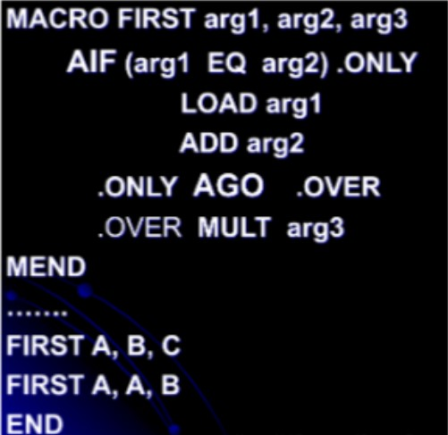
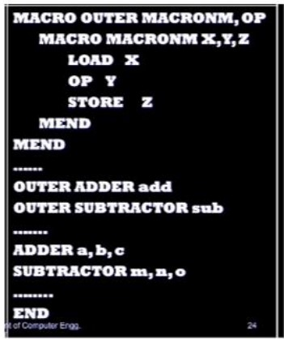

# Very Important 

## Please see the drive

https://drive.google.com/drive/folders/11CcPlX-VAKegRTCOT1SPGGLyPHQuC8oO?usp=sharing

## Unit 1 Assembler 

> Q1. An interpreter is ................

      1. It is a program that appears to 
         execute a source program as if it 
         were machine language
      2. A program that automate the 
         translation of assembly language 
         into machine language
      3. Program that accepts a program 
         written in a high level language 
         and produces an object program
      4. A program that places programs 
         into memory and prepares them 
         for execution

**Answer :**  Option 1

*Explanation : Interpreter reads and excutes code line to line*

> Q2. A translator that read program in HL language and converts the code into low level language called?

    1. compiler
    2. translator
    3. assembler
    4. system software

**Answer :**  Option 1

*Explanation : A complier converts HL code to machine language*

> Q3. The symbol table implementation is based on the property of locality of reference?

    1. Linear tree
    2. Search tree 
    3. Hash table
    4. None

**Answer :**  Option 1

*Explanation : The aim of a self-organizing list is to improve efficiency of linear search by moving more frequently accessed items towards the head of the list. The property of frequently accessing same values, or related storage locations is termed as Locality of Reference.*

> Q4. A compiler for a high-level language that runs on one machine and produces code for a different machine is called ............................

      1. optimizing compiler
      2. one pass compiler
      3. cross compiler
      4. multipass compiler

**Answer :**  Option 3

*Explanation : A cross compiler is a compiler capable of creating executable code for a platform other than the one on which the compiler is running. In paravirtualization, one computer runs multiple operating systems and a cross compiler could generate an executable for each of them from one main source.* 

>Q5. An assembly program contains...

    1. Imperative statements and assembler directives
    2. Imperative and declarative statement
    3. Imperative and declarative statement as well as assembler directive
    4. Declarative statements and assembler directive

**Answer :** Option 3

*Explanation : There is something always missing in options 1,2 and 4*

>Q6 The assembler directives which are the hints using some predefined alphabetical strings are given to .....

    1. processor
    2. memory
    3. assembler
    4. processor & assembler

**Answer :**  Option 3

*Explanation : These directives help the assembler to correctly understand the assembly language programs to prepare the codes.*

> Q7. In two pass assembler the object code generation is done in ....... pass

    1. Second pass
    2. First pass
    3. Zeroth pass
    4. Third pass

**Answer :** Option 2

*Explanation : First pass generate object code*

> Q8. What is the result of complier?

      1. Assembly Code
      2. Machine Code
      3. Result
      4. None 

**Answer** : Option 1 

*Explanation : Result of complier is Assembly Code*

> Q9. Which of the following system program foregoes the production of object code to generate absolute machine code and load it into the physical main storage location from which it will be executed immediately upon completion of the assembly?

      1. Macro processor
      2. load and go assembler
      3. Two pass assembler
      4. complier

**Answer :**  Option 2

*Explanation : Two pass assembler also does the same work but doesn't provide ability to load quickly and run the code*

> Q10. Difference between Compiler and Interpreter?

      1. Compiled code runs slower
      2. Interpreter is beased on linking-loading model
      3. Interpreted code runs slower.
      4. Interpreter coverts high-level program into machine code

**Answer :** Option 3

> Q11. Each line in assembly lang cannot be ....

      1. an instruction 
      2. an assembler directive
      3. a comment
      4. Opcode

**Answer :** Option 4

> Q12. Final address of Symbol L

      1. 100
      2. 102
      3. 109
      4. 107

**Answer :** Option 4

> Q13. How many pools are there

      1. 1
      2. 2 
      3. 4
      4. 3

**Answer :** Option 1

> Q14. Which of the following is not mandatory in assemblt program?

      1. Opcode
      2. Operands
      3. Label
      4. None

**Answer :** Option 3

> Q15. Which of the following is not an assembly directive? 

      1. START
      2. EQU
      3. AREG
      4. END

**Answer :** Option 3

> Q16. Which statement assigns addresses to literal after it comes?

      1. START
      2. END
      3. LTORG
      4. EQU

**Answer :** Option 3

> Q17. Address of literal 1?

      1. 205
      2. 206
      3. 211
      4. 203

**Answer :** Option 1

> Q18. Address of BACK?

      1. 202
      2. 210
      3. 203
      4. 204

**Answer :** Option 1

> Q19. START is a ___

      1. Imperative Statement
      2. Declarative Statement
      3. Assembly Director
      4. None

**Answer :** Option 3

> Q20. What happens in phases of assembler?

      1. Analysis
      2. Syntax
      3. Both
      4. None

**Answer :** Option 3

## Unit 2 Macroprocessors

>Q1. In which way(s) can a macro processor for assembly language be implemented ?

    1. independent one-pass processor
    2. independent two-pass processor
    3. processor incorporated into pass 
       of a standard two-pass assembler
    4. all of the above

**Answer :** Option 4

*Explanation : We can use all the above ways for making a macroprocessor*

> Q2. The advantage(s) of incorporating the macro processor into pass 1 is/ are:
 

      1. Many functions do not have to be 
         implemented twice
      2. Functions are combined and it is 
         not necessary to create 
         intermediate files as output from 
         the macro processor and input to 
         the assembler 
      3. more flexibility is available to 
         the programmer in which he/she may 
         use all the features of the 
         assembler in conjunction with 
         macros
      4. All of the above

**Answer :**  Option 4

*Explanation : The implementation of the macro-processor within pass 1 eliminates the over-head of intermediate files and we can improve this integration of macro-processor and assembler by combining similar functions. This gives us the above advantages*

>Q3. A self-relocating program is one which?

    1. cannot be made to execute in any 
       area of storage other than the one 
       designated for it at the time of its 
       coding or translation
    2. consists of a program and relevant 
       information for its relocation
    3. can itself perform the relocation of 
       its address-sensitive portions
    4. All of the above

   **Answer :** Option 3

*Explanation : The program performs its own relocation and does not require a linker is called as self-relocating program*

> Q4. Subroutine linkage is a method where ...

      1. A way in which computer call and return the 
      Subroutine
      2. Uses of multiple entry points
      3. Both
      4. None

**Answer :** Option 3

> Q5. The advantage(s) of incorporating the macro processor into pass 1 is/ are:

      1. The advantage(s) of incorporating the macro processor into pass 1 is/ are:
      2. Functions are combined and it is not necessary to create intermediate files as output from the macro processor and input to the assembler
      3. more flexibility is available to the programmer in which he/she may use all the features of the assembler in conjunction with macros
      4. All the above

**Answer :** Option 4

> Q6. A system program that combines the separately compiled modules of a program into a form suitable

      1. Assembler
      2. Linking loader
      3. Cross compiler
      4. Load and go

**Answer :** Option 2

*Explanation : A loader which combines the functions of a relocating loader with the ability to combine a number of program segments that have been independently compiled into an executable program*

> Q7. Absolute loader demands that the programmer needs to know the

      1. Start address of the available main memory
      2. Total size of the program
      3. Actual address of the data location
      4. Absolute values of the operands used

**Answer** : Option 1

*Explanation : An absolute loader is a kind of loader in which relocated object files are created*

> Q8. Which of the following statement(s) regarding a linker software is/are true ?

a) A function of a linker is to combine several object modules into a single load module.
 
b) A function of a linker is to replace absolute references in an object module by symbolic references to
ocations in other modules.

      1. a 
      2. b
      3. a and b
      4. None

**Answer** : Option 1

> Q9. The translator which perform macro expansion is called a

      1. Macro processor
      2. Macro pre-processor
      3. Micro pre-processor
      4. Assembler

**Answer** : Option 2

> Q10. Dynamic linking loader, Loading and linking of external references are postponed until ...

      1. Runtime (Execution)
      2. Just before runtime
      3. after runtime
      4. None of the following

**Answer** : Option 1

> Q11. Macro processor is an inbuilt function of ?

      1. Loader
      2. Editor
      3. Linker
      4. Assembler

**Answer** : Option 4

> Q13. A macro within a macro is called

      1. Macro-within-macro
      2. Nested macro
      3. Macro-in-macro
      4. None

**Answer** : Option 2

> Q14. There are total ____  types of Macros?

      1. 5
      2. 3
      3. 2
      4. 6

**Answer** : Option 1

> Q15. Macros can be defined at ___

      1. Anywhere
      2. At start
      3. At end
      4. None of the above

**Answer** : Option 1

> Q16. Which of the following are the principles tasks of the linker?

1. Resolve external references among separately compiled program units  
2. Translate assembly language to machine code. 
3.  Relocate code and data relative to the beginning of the program 
4. Enforce access-control restrictions on system libraries 

      1. I and II
      2. I and Ill 
      3. II and Ill
      4. I and IV

**Answer** : Option 2

*Explanation:The linker is a computer program that takes one or more object files generated by a compiler and combines them into one executable program*

> Q17. The linker

      1. Is similar to interpreter
      2. Uses source code as its input
      3. Is required to create a load module
      4. None of the above

**Answer** : Option 2

*Explanation: In assembly language the pieces of a big application program can be written as separate source files and assembled into separate object modules*

> Q18. What is the Expanded code for the Following

      1. LOAD A 
         ADD B
         MULT C
         MULT B
         END

      2.LOAD A 
         ADD B
         MULT C
         MULT B

      3. None

      4. Both are correct

**Answer** : Option 1

> Q19. Identify the following macro __

      1. Nested macro
      2. Macro with parameters
      3. Simple macro
      4. None

**Answer** : Option 1

> Q20. Which pass of macro processes the definition of macro?

      1. Definition mode
      2. Expansion mode 
      3. Both
      4. None

**Answer** : Option 1

## Unit 3

>Q1. What is the action of parsing the source program into proper syntactic classes known as

      1. Interpretation analysis
      2. General syntax analysis
      3. Syntax analysis
      4. Lexical analysis

**ANS: 3. Syntax analysis** 

*Explaination: The action of parsing the source program into the proper syntactic classes is known as syntax analysis. A syntax analyzer or parser takes the input from a lexical analyzer in the form of token streams. The parser analyzes the source code (token stream) against the production rules to detect any errors in the code. The output of this phase is a parse tree.
In syntactic analysis, parse trees are used to show the structure of the sentence, but they often contain redundant information due to implicit definitions.Parsing, syntax analysis or syntactic analysis is the process of analyzing a string of symbols, either in natural language, computer languages or data structures, conforming to the rules of a formal grammar.*

>Q2. Which of the following is definition of compiler?

       1.  Acceptance of a program written in a high-level language and produces an object pr
       ogram
       2. Program is put into memory and execut
       es it
       3. Translation of assembly language into machine
        language
       4. None of the mentioned

**ANS: 1. Acceptance of a program written in a high-level language and produces an object program**

*Explaination: A compiler is a software (or combination of programs) that converts source code written in one programming language (the source language) into code written in another programming language (the target language) (the target language, often having a binary form known as object code).*

>Q3. Which of the following does an address code involve?

       1. No unary operators
       2. Exactly 3 address
       3. At most Three address
       4. None of the mentioned

**ANS: 4. None of the mentioned**

*Explaination: In computer science, three-address is an intermediate code used by optimizing compilers to aid in the implementation of code-improving transformations.*

>Q4. In which of the following phase of the compiler is Lexical Analyser?

      1. Second
      2. Third
      3. First
      4. All of the mentioned

**ANS: 3. First**

*Explaination: Lexical Analyzer is the First Phase of the Compiler.*

>Q5. What is the linker?

       1. It is always used before program execution
       2. It is required to create load module
       3. It is same as the loader
       4. None of the above

**ANS: 2. It is required to create load module**

*Expaination:  Linker is a program in the compiler which is required to create a load module.*

6. In compiler Lexical analyzer is used for?

       1. removing comments
       2. removing whitespaces
       3. breaking the synatxes into set of tokens
       4. All of the mentioned

**ANS: 4. All of the mentioned**

*Explaination: Lexical analyzer is used in the compiler for removing the Whitespace and comments. It is also used in breaking the syntaxes into the set of tokens.*

7. Which is considered as the sequence of characters in a token?

       1. Mexeme
       2. Lexeme 
       3. Texeme
       4. Pattern

**ANS: 2.Lexeme**

*Explaination:  Lexemes are the string of alphanumeric characters in a single token. In the source program, lexemes are characters which are identified by the pattern for a token.*

>Q8. Which of the following component is important for semantic analysis?

       1. Yay
       2. Lex
       3. Type checking
       4. Symbol table

**ANS: 3. Type checking**

*Explaination: In the semantic analysis, type checking is an important component because it verifies the program's operations from the semantic conventions.*

>Q9. Which phase of the compiler is also known as Scanner?

      1. Syntax Analysis
      2. Lexical Analysis
      3. Semantic Analysis
      4. Code generation

**ANS: 2. Lexical Analysis**

*Explaination: The first part of the compiler (lexical analysis) is also known as a scanner. It scans the characters from the source program and implements them to produce tokens.*

>Q10. Which phase of the compiler is also known as Parser?

      1. Code Optimization
      2. Semantic Analysis
      3. Synatx Analysis
      4. Lexical Analysis

**ANS: 3. System Analysis**

*Explaination: The phase of the compiler next to the lexical analysis phase is also known as Parser.
Syntax analysis or parser accepts the tokens produced by the lexical analysis and gives the parse tree in the output.*

>Q11. The full form of YACC is:

      1. Yet Another Computer Computer
      2. Yet Another Computer Compiler
      3. Yet Another Compiler Computer
      4. Yet Another Compiler Compiler

**ANS: 4. Yet Another Compiler Compiler**

*Explaination: The full form of YACC is Yet Another Compiler Compiler, which produces the LALR (1) grammar parser.*

>Q12. What is the output of lexical analyzer?

      1. A set of RE
      2. Syntax Tree
      3. Set of Tokens
      4. String Character

**ANS: 3. Set of tokens**

*Explaination:A lexical analyzer coverts character sequences to set of tokens.*

>Q13. If the lexical analyser finds a lexeme with the same name as that of a reserved word,it

       1. overwrites the word
       2. overwrites the functionality
       3. generates an error 
       4. something else

**ANS: 3. generates an error**

*Explaination: Reserved words are known as keywords and they are specific and reserved with its functionality to a language. Thus, getting an input with the same name by the analyzer will generate an error.*

>Q14. A lexical analyzer reads the source code line by line.

       1. True
       2. False

**ANS: 2. False**

*Explaination: A lexical analyzer reads the source code letter by letter and when it encounters a space or an operator or any special character, it decides that the word is completed.*

>Q15. A program that performs lexical analysis is termed as:

       1. scanner
       2. lexer
       3. tokenizer
       4. all of the mentioned

**ANS: 4. all of the mentioned**

*Explaination: A program which performs lexical analysis is called lexer, scanner or lexer. Nowadays, lexer is combined with a parser which allows syntactic analysis.*

>Q16. Which of the following can detect an error if a programmer by mistake writes multiplication instead of division

       1. Intrepreter
       2. Compiler or Intrepreter test
       3. Compiler
       4. None of the mentioned

**ANS: 4. None of the mentioned**

*Explaination: No Logical errors can’t be detected.*

> Q17. In analyzing the compilation of PL/I program, the description "resolving symbolic address (labels) and generating machine language" is associated with

      1. Assembly and output
      2. Code generation
      3. Storage assignment
      4. Syntax analysis

**Answer** : Option 1

> Q18. Compilers can generate ____ type of code 

      1. Pure Machine Code 
      2. Augmented Machine Code
      3. Virtual Machine Code
      4. Object Code

**Answer** : Option 4

> Q19. Parsing generates a ___

      1. Tree 
      2. Abstract Syntax Trees
      3. Syntax Trees
      4. None

**Answer** : Option 4

> Q20. There are total __ phases of compiler

      1. 7
      2. 8
      3. 6
      4. 2

**Answer** : Option 1
